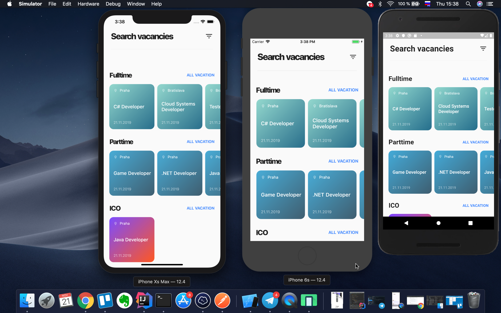

# BridgeWater

Cross-platform prototype app for Android & iOS that was written in Flutter&Dart.

## Video

## Screenshot

## More about Flutter

You are welcome to read Flutter official[ online documentation](https://flutter.dev/docs), which offers tutorials,
samples, guidance on mobile development, and a full API reference.
